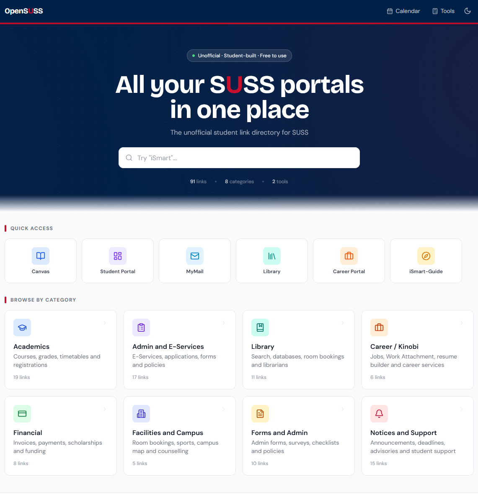
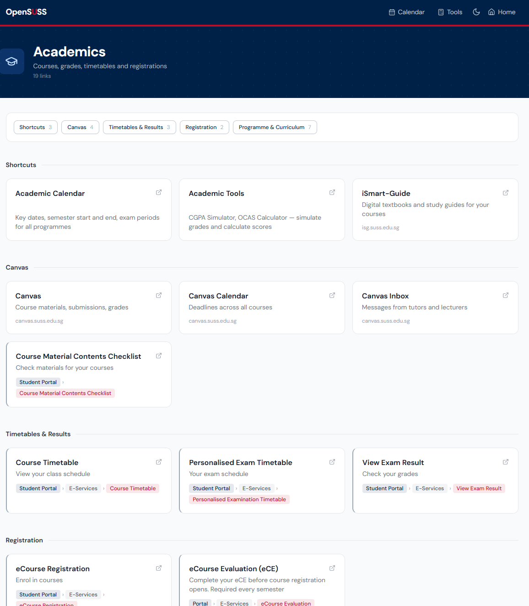
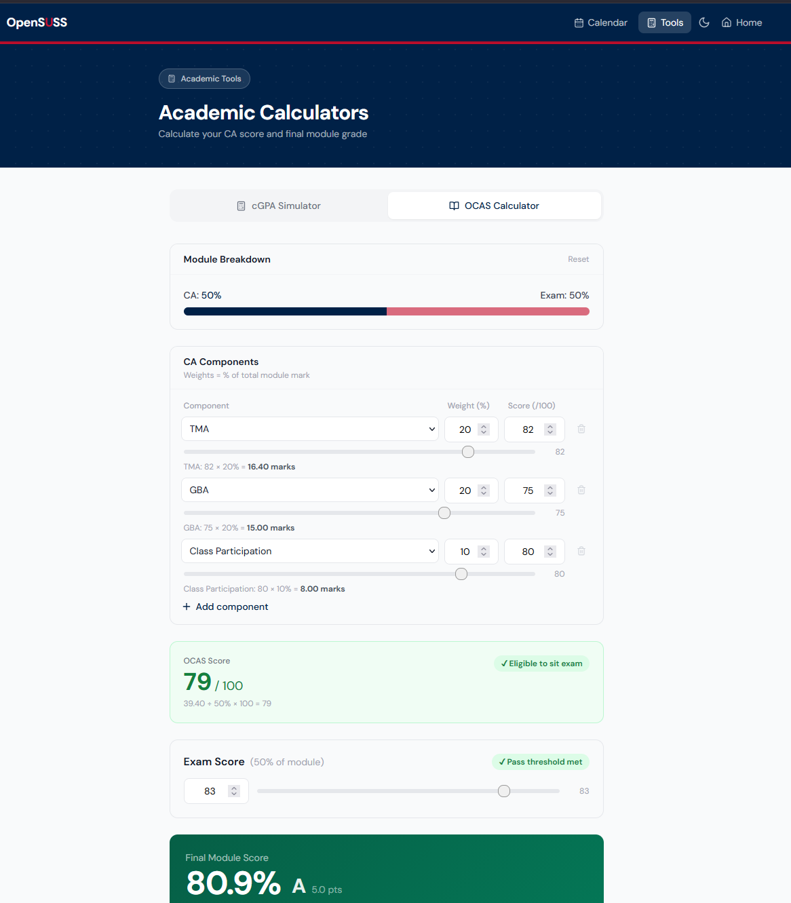

# OpenSUSS

**All your SUSS portals in one place.**

🔗 **Live site: [opensuss.vercel.app](https://opensuss.vercel.app)**

---

SUSS offers a lot: academics, room bookings, career tools, financial aid, and more. The catch is each one lives on its own portal.

So you end up with five tabs open trying to find your exam timetable. Or you want to book a discussion room but can't quite remember where the link is. Or you open Backpack, stare at it for a moment, and close it.

OpenSUSS is a student-built shortcut to all of it.

OpenSUSS is the unofficial fix. It is a student-built hub that organises every SUSS service you actually use, searchable, categorised, and accessible in seconds. No login. No data collected. Just links.

---

---

## What's inside

- **Quick access strip** — one-click access to Canvas, Student Portal, MyMail, Library and Career Portal
- **Search** — find any link across all categories instantly by name, description or portal path
- **8 categories** — Academics, Admin and E-Services, Library, Career, Financial, Facilities and Campus, Forms and Admin, and Notices and Support
- **Academic Calendar** — dedicated page with calendars for Full-time UG, Part-time UG, Law and Postgrad programmes
- **Breadcrumb navigation paths** — for Student Portal links, step-by-step paths show exactly where to go after logging in
- **Live library room availability** — direct link to the real-time discussion room booking grid
- **Tools** — CGPA Simulator and OCAS Calculator for quick academic planning
- **Report broken links** — flag any outdated link directly from the card, with a confirmation step to prevent accidental submissions

---

---

## Suggest a link or report an issue

This project does not accept pull requests at this time. If you have a suggestion for a new link, a broken URL to report, or any other feedback, please fill in the feedback form at the bottom of the live site at [opensuss.vercel.app](https://opensuss.vercel.app).

All submissions go directly to the maintainer and are reviewed regularly.

---

---

## Disclaimer

OpenSUSS is an independent student project and is **not affiliated with, endorsed by, or officially connected to Singapore University of Social Sciences (SUSS)** in any way. All links point to official SUSS services. This site simply organises them in one place.

If any link is outdated or incorrect, please submit feedback via the form on the site.

---

## Built with

- [React](https://react.dev) — UI framework
- [Tailwind CSS](https://tailwindcss.com) — styling
- [React Router](https://reactrouter.com) — client-side navigation
- [Formspree](https://formspree.io) — feedback form
- [Vercel](https://vercel.com) — hosting

---

## Credits

Built by **Jung Yong** — SUSS Business Analytics student.

---

*One less thing to hunt for.*
